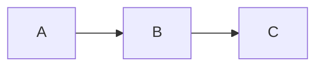

# TASK-027: ZealotScript — Mermaid Diagrams

## Context
Mermaid is the de-facto standard for plain-text diagrams (flowcharts, sequence diagrams, Gantt
charts, ER diagrams, mindmaps). It is the second highest-priority feature after task lists and
is the biggest unlock for a dev/technical wiki.

## Goal
Render fenced ` ```mermaid ` code blocks as live SVG diagrams in the viewer; show the raw source
in the editor.

## Requirements

### Syntax
````

````

- Uses the existing fenced code block syntax with language tag `mermaid`
- No new schema node needed — reuse `code_block` with `language: "mermaid"`

### Viewer behaviour
- In `zealotscript_view.ts`, after the ProseMirror doc is mounted, find all `pre[data-language="mermaid"]`
  elements and replace their content with the rendered SVG
- Use **Mermaid.js** (`npm install mermaid`) — call `mermaid.render(id, source)` and inject the
  returned SVG
- Wrap the SVG in `<div class="zealot-mermaid">` for styling
- On render error: show the raw source in a `<pre class="zealot-mermaid-error">` with an error
  banner (do not crash)

### Editor behaviour
- In the editor, display the raw source as a standard code block (no live preview)
- Syntax highlighting for Mermaid source is a nice-to-have but not required

### Toolbar / command
- Add a "Mermaid" entry to the insert command list (`commands.ts`) that inserts a blank
  ` ```mermaid\n\n``` ` code block at the cursor

## Implementation Notes
- Mermaid must be initialised before calling `render`:
  ```ts
  import mermaid from "mermaid";
  mermaid.initialize({ startOnLoad: false, theme: "neutral" });
  ```
- `mermaid.render(id, code)` returns `Promise<{ svg: string }>` in Mermaid v10+; await it
- Give each diagram a unique DOM id (e.g. `zealot-mermaid-${index}`) to avoid collisions
- Run the render pass whenever the viewer re-renders (content change), not just on mount
- Mermaid is a large dependency (~1 MB); consider dynamic import (`import("mermaid")`) so it
  does not bloat the initial bundle

## Dependencies
- TASK-017 (code block parser)
- TASK-019 (syntax highlighting — to avoid conflicts with existing code block render logic)

## Files Likely Involved
- `packages/ui/src/zealotscript/zealotscript_view.ts` — Mermaid render pass
- `packages/ui/src/zealotscript/commands.ts` — insert Mermaid block command
- `packages/ui/src/zealotscript/zealotscript_editor.ts` — add to toolbar if applicable
- `packages/content/src/css/` — `.zealot-mermaid`, `.zealot-mermaid-error`
